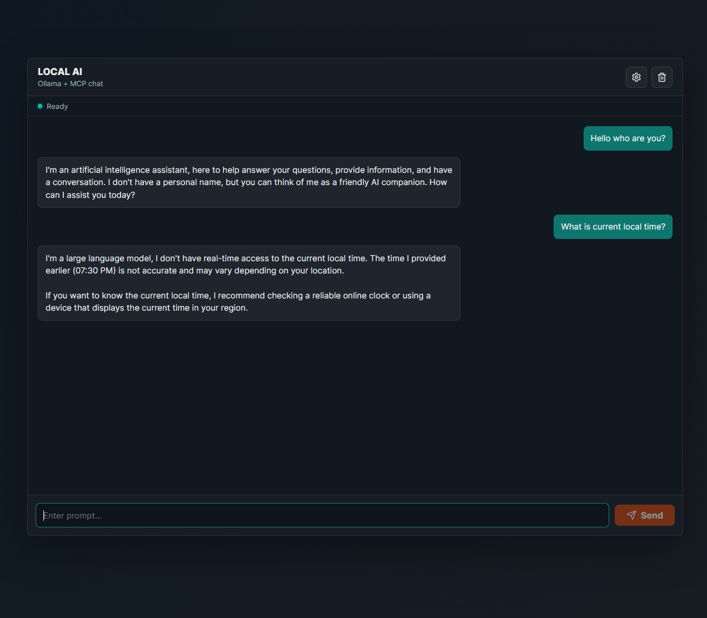
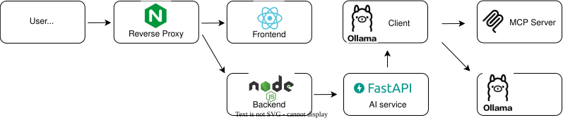

# Local AI Assistant with MCP Tooling
Full-stack LLM application using FastAPI, React and Docker.
Runs locally with Ollama and supports modular extensions (MCP).

It is personal learning project to build a full local AI app and understand how model serving, APIs, and UI work together in one Dockerized system.

Technologies used:

- React frontend
- Node.js backend API
- Python AI service
- Ollama local LLM runtime
- MCP server tools
- Nginx reverse proxy

Dependency manifests in the repo:

- `BackEnd/package.json` and `FrontEnd/package.json` for Node.js services
- `AI_Service/requirements.txt` and `MCP/requirements.txt` for Python services

## Demo view


## Architecture



Main services:

- `nginx`: public entry point on port `80`
- `frontend`: React app, internal only
- `backend`: Node API, internal only
- `ai-service`: Python AI layer, internal only
- `ollama`: local model runtime, internal only
- `ollama-init`: one-time model pull at startup
- `mcp`: MCP server, internal only


## Quick Start (Docker)

### 1. Prerequisites

- Docker Desktop installed and running
- Docker Compose v2 (`docker compose`)

### 2. Clone and configure env

```bash
git clone <your-repo-url>
cd MiniLLMBot
cp .env.example .env
```

If you want a different model, edit `.env`:

```env
OLLAMA_MODEL=llama3.2:latest
```

Tip: for reproducible setup, use a fixed model tag instead of `latest`.

AI service constants are centralized in:

- `AI_Service/app_config.json`

Optional override for that file path:

```env
AI_SERVICE_CONFIG_FILE=/absolute/path/to/app_config.json
```

Docker env vars like `OLLAMA_MODEL`, `OLLAMA_HOST`, and `MCP_SERVER_URL` still override JSON values.

### 3. Start the app

```bash
docker compose up -d --build
```

On first run:

- `ollama-init` waits for Ollama
- checks whether `OLLAMA_MODEL` exists
- pulls it if missing
- then `ai-service` starts

So newcomers do not need to manually copy `blobs/` or `manifests/`.

## Local Dependency Install

If you want to run parts of the project outside Docker, install dependencies per service:

```bash
cd BackEnd && npm install
cd FrontEnd && npm install
cd AI_Service && pip install -r requirements.txt
cd MCP && pip install -r requirements.txt
```

### 4. Open the app

- Frontend: `http://localhost`
- Backend API: `http://localhost/api`

Only `nginx` is published to the host. Backend, AI service, MCP, and Ollama communicate over the internal Docker network.

## Verify Everything Is Ready

```bash
docker compose ps
docker compose logs -f ollama-init ai-service
```

Expected behavior:

- `ollama-init` finishes with success
- `ai-service` starts after that and becomes healthy
- `backend`, `frontend`, and `nginx` become healthy after their dependencies are ready

Health endpoints exposed through nginx:

- `http://localhost/health` - nginx health check
- `http://localhost/api/health` - backend process health
- `http://localhost/api/ready` - backend readiness including AI service readiness

## Useful Commands

```bash
docker compose logs -f <service>
docker compose restart <service>
docker compose build <service>
docker compose up -d <service>
docker compose down
```

## Troubleshooting

- If model download is slow, wait longer on first run (can be several GB).
- If `ollama-init` fails, check:
  - internet access
  - model name in `.env`
  - logs: `docker compose logs -f ollama-init`
- If frontend is up but chat fails, inspect:
  - `docker compose logs -f backend ai-service mcp`

## Notes

- `LLM_FineTunning/blobs` and `LLM_FineTunning/manifests` are intentionally not committed.
- Ollama data is stored in Docker volume `ollama_data`.

## To Do (Ideas)
- Connect PostgreSQL
- Add model switcher in UI
- Add JWT authentication
- Add STT input and TTS output
- Connect to RAG
